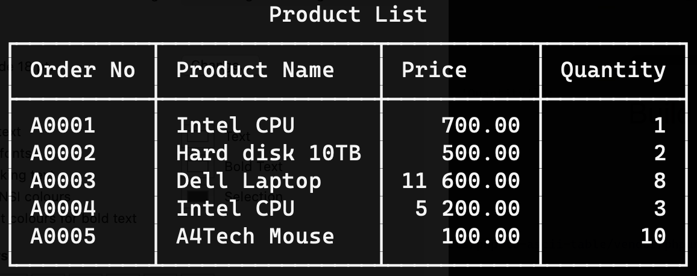

# php-to-ascii-table
A small PHP library for generating plain text tables.



## Getting Started
### Prerequisites

- PHP >= 7
- Optionally Install [php-ds](https://github.com/php-ds/extension) extension (Recommended).

### Installation

Install via composer:

```bash
$ composer require malios/php-to-ascii-table

```

## Usage

```php
<?php
    $builder = new \AsciiTable\Builder();
    
    $builder->addRows([
        [
            'Order No' => 'A0001',
            'Product Name' => 'Intel CPU',
            'Price' => 700.00,
            'Quantity' => 1
        ],
        [
            'Order No' => 'A0002',
            'Product Name' => 'Hard disk 10TB',
            'Price' => 500.00,
            'Quantity' => 2
        ],
        [
            'Order No' => 'A0003',
            'Product Name' => 'Dell Laptop',
            'Price' => 11600.00,
            'Quantity' => 8
        ],
        [
            'Order No' => 'A0004',
            'Product Name' => 'Intel CPU',
            'Price' => 5200.00,
            'Quantity' => 3
        ]
    ]);
    
    $builder->addRow([
        'Order No' => 'A0005',
        'Product Name' => 'A4Tech Mouse',
        'Price' => 100.00,
        'Quantity' => 10
    ]);
    
    echo $builder->renderTable();
    
    // Show only some fields
    
    $builder->showColumns(['Order No', 'Product Name', 'Quantity']);
    
    echo $builder->renderTable();
    
```
### Build table from objects
You can build table form any object that implements JsonSerializable interface.

```php
<?php
    
    class Person implements \JsonSerializable 
    {
        private $name;
        
        private $age;
        
        public function __construct(string $name, int $age) {
            $this->name = $name;
            $this->age = $age;
        }
        
        public function jsonSerialize()
        {
            return [
                'name' => $this->name,
                'age' => $this->age
            ];
        }
    }
    
    $builder = new \AsciiTable\Builder();
    
    $builder->addRow(new Person('John', 25));
    $builder->addRow(new Person('Bill', 30));
    
    echo $builder->renderTable();

```

## Contributing

All contributors are welcome. You can open a new issue or submit a pull request.
See [CONTRIBUTING.md](docs/CONTRIBUTING.md) for details.

## License

This project is licensed under the MIT License - see the [LICENSE.md](LICENSE.md) file for details.
